# Балкански легенди — живото ИИ село

3D ролева игра в свят от българските митове: Ламята, самодивите, таласъмите и Караконджулът. Жителите на селото Самодивско са **живи ИИ герои** с характер, памет и тайни. Говорят си, клюкарстват, карат се, влюбват се и сами си избират кмет. Всичко се записва в летопис, а с машината на времето можеш да гледаш историята назад и да я разклониш („Ами ако…?“).

- **Играй в браузъра:** https://me7ko-dev.github.io/Ai-selo/ (там жителите говорят по сценарий)
- **За Windows:** [Releases → latest](https://github.com/me7ko-dev/Ai-selo/releases/tag/latest) → свали `BalkanskiLegendi-windows.zip`, разархивирай и пусни `BalkanskiLegendi.exe`
- **Графика:** реалистична — физично небе и светлина, гъста трева стрък по стрък, смърчова гора, възрожденски къщи с истински камък, вар и керемиди, хора в носии с истински анимации, Ламя с релефни люспи, таласъми — неспокойни мъртъвци със светещи очи, овце с истинска вълна и коне, които можеш да опитомиш, оседлаеш и яздиш. Качеството се избира само според видеокартата (**Esc → Графика**: Ниско / Средно / Високо); на лаптоп с GTX 1650 върви на „Високо“ (около 50–90 кадъра/с при 1080p), а ако стане бавно, играта сама минава на „Средно“. Текстури и модели — Poly Haven, Quaternius (CC0), ez-tree (MIT): [public/assets/CREDITS.md](public/assets/CREDITS.md).
- Планът и решенията: [PLAN.md](PLAN.md) · Благодарности и лицензи: [CREDITS.md](CREDITS.md)

## Снимки

<p>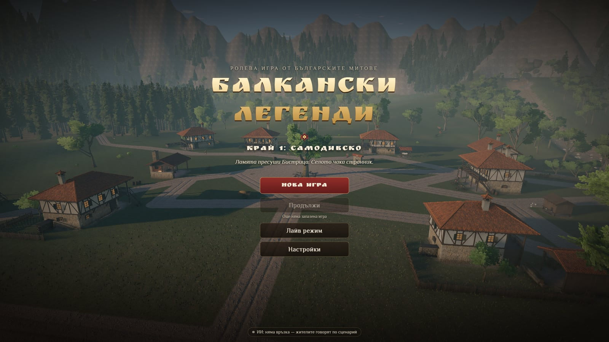 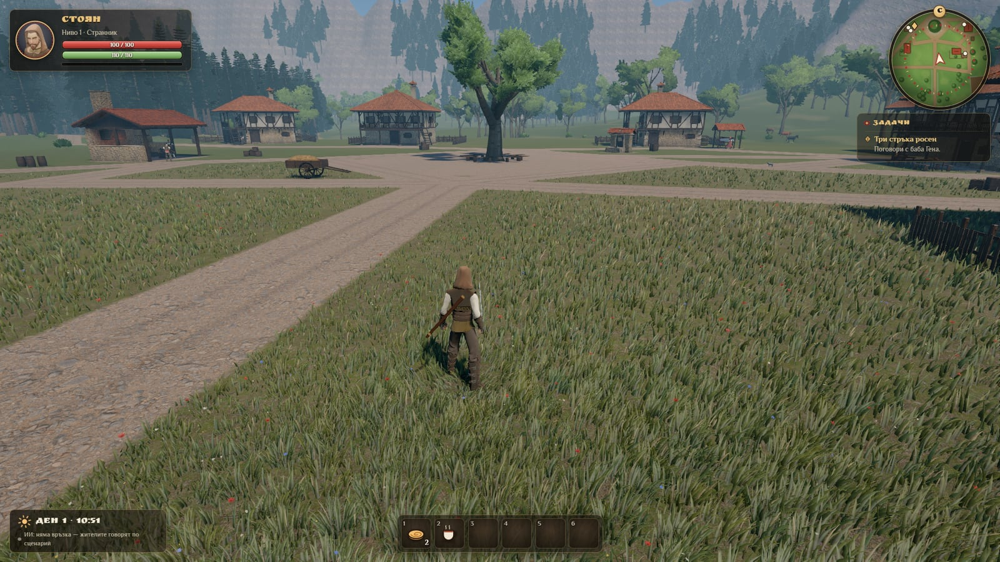</p>
<p><em>Начален екран</em> · <em>Самодивско денем</em></p>

<p>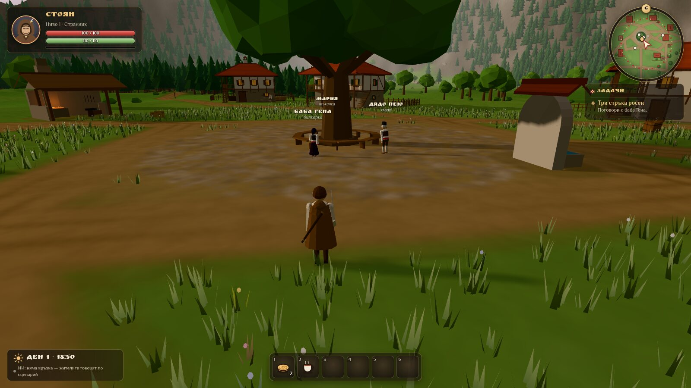 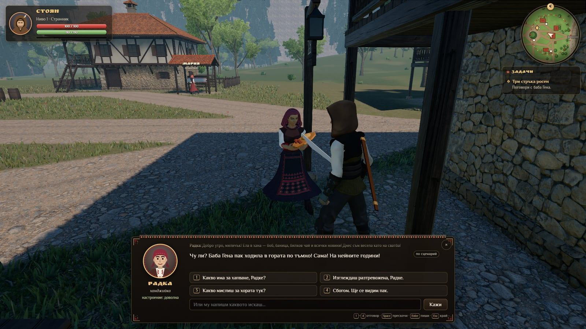</p>
<p><em>Клюки на мегдана</em> · <em>Разговор с Радка</em></p>

<p>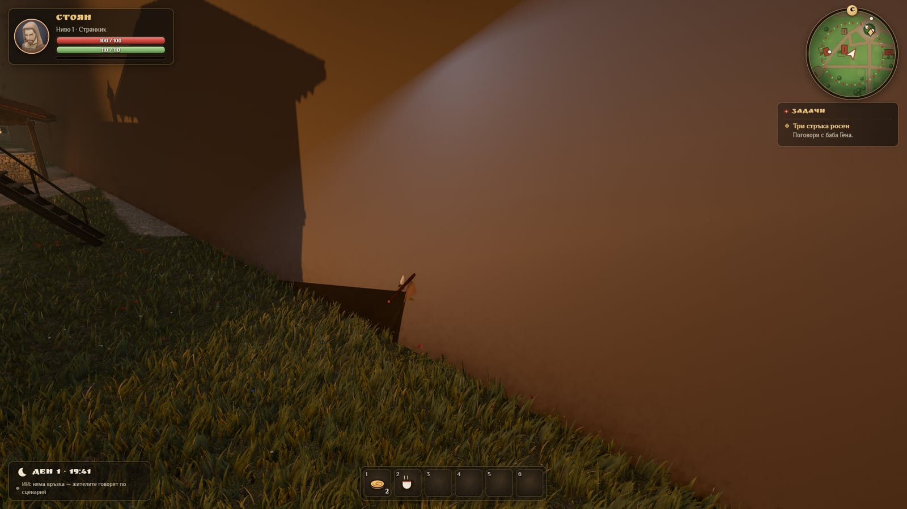 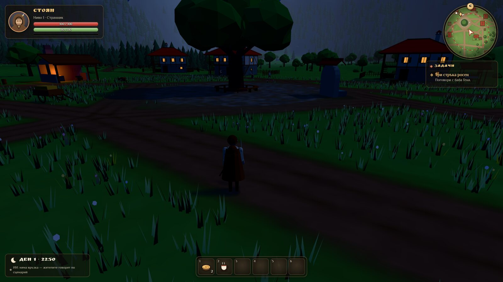</p>
<p><em>Залез над селото</em> · <em>Селото нощем</em></p>

<p>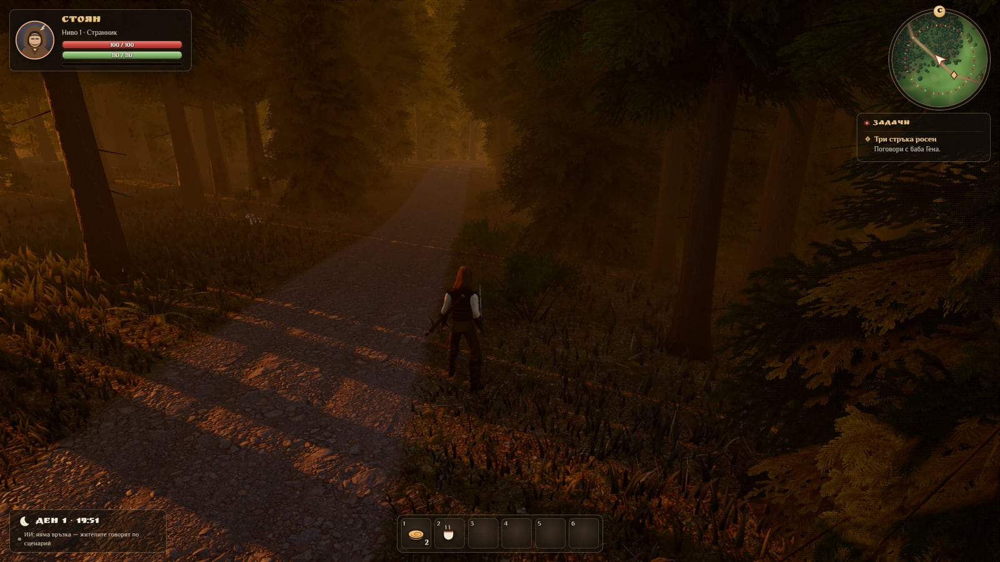 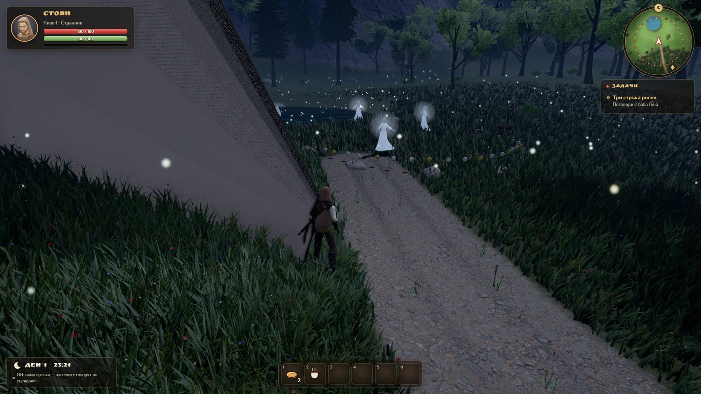</p>
<p><em>Тъмната гора по здрач</em> · <em>Поляната на самодивите</em></p>

<p>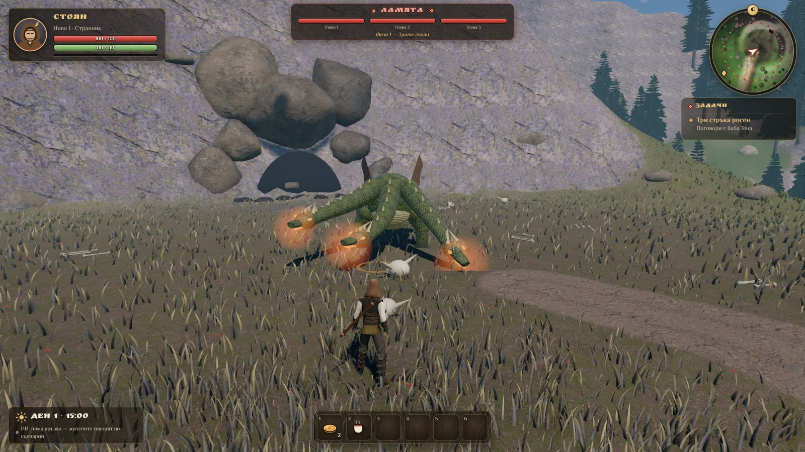 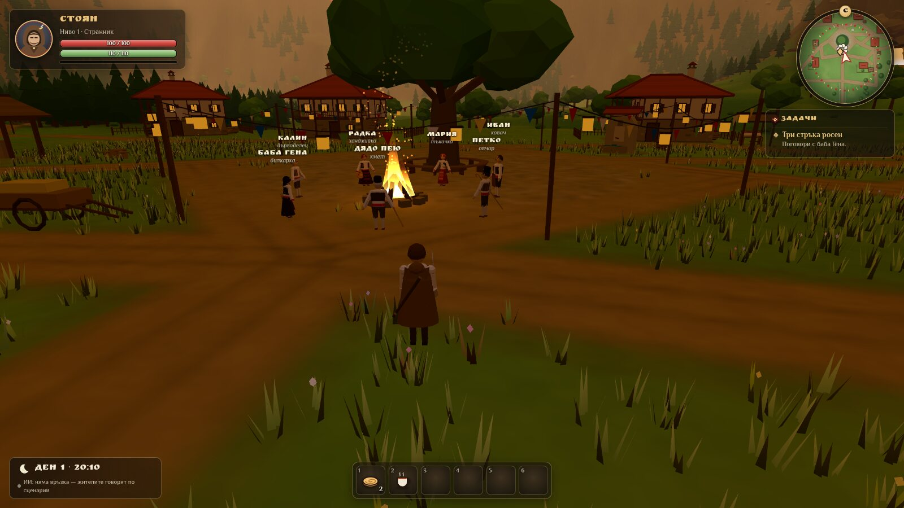</p>
<p><em>Ламята на Ламин връх</em> · <em>Сборът след победата</em></p>

<p>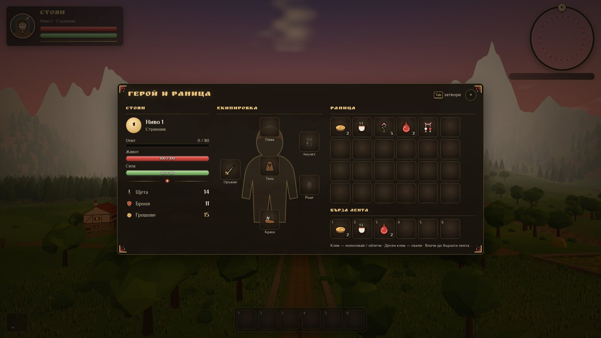 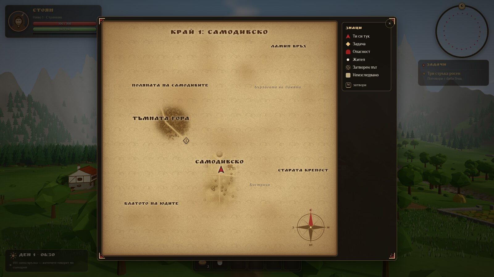</p>
<p><em>Герой и раница</em> · <em>Картата на света</em></p>

<p>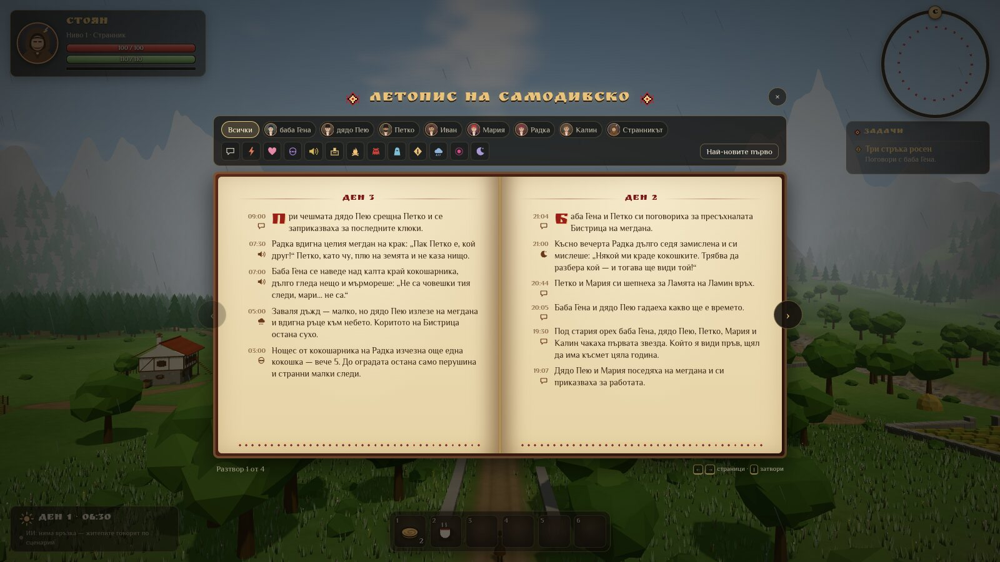 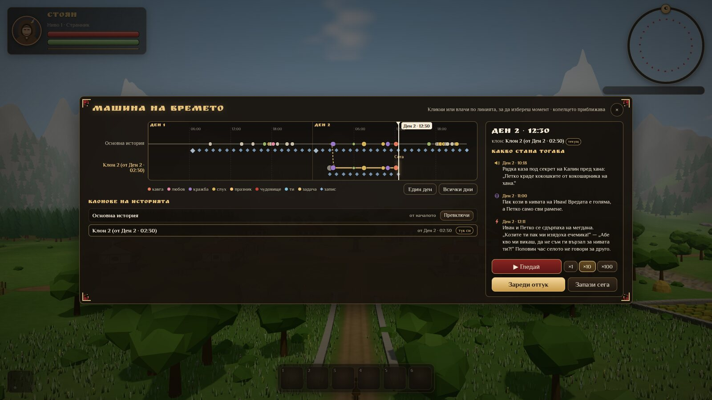</p>
<p><em>Летописът</em> · <em>Машината на времето</em></p>

<p>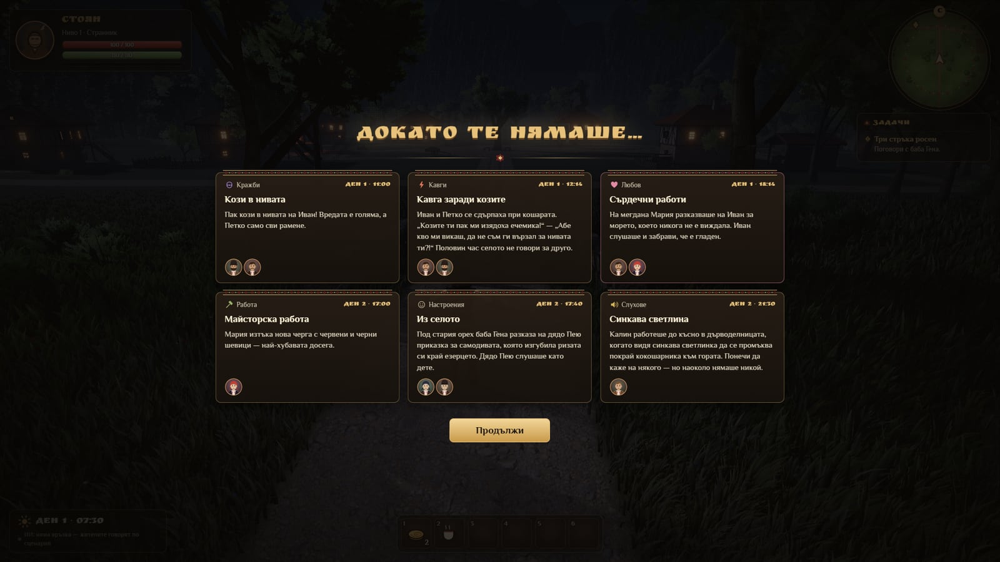 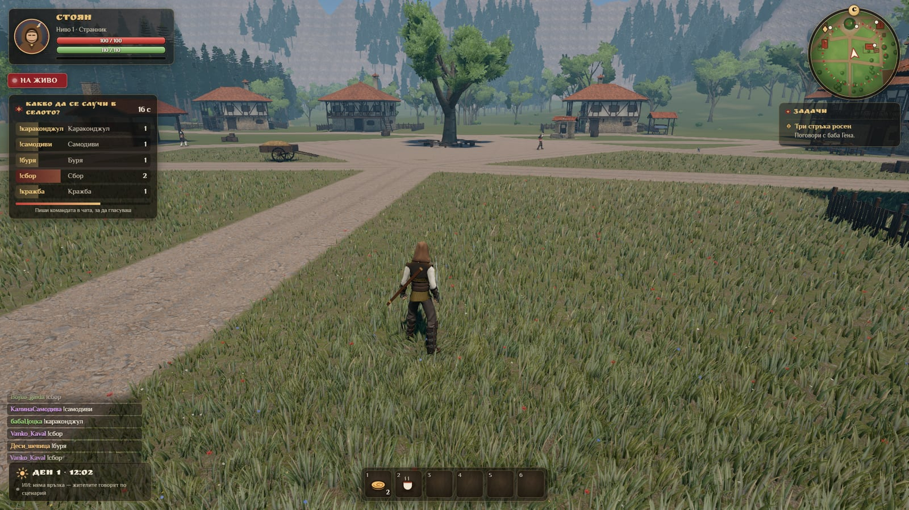</p>
<p><em>„Докато те нямаше…“</em> · <em>Лайв режим — гласуване</em></p>

Снимките са направени от робот (`npm run shot`; `SHOT_QUALITY=high` за „Високо“ без видеокарта, `SHOT_GPU=1` с истинската).


## Историята
Ламята пресуши река Бистрица и нивите умират. Ти си Стоян — странник с кафяво наметало и сабя на гърба. Помогни на хората от Самодивско, разбери им тайните и тръгни към Ламин връх.

**Задачи:**
1. **„Три стръка росен“** — баба Гена иска три стръка от билката росен от Тъмната гора. Внимавай: по здрач излизат таласъми.
2. **„Кой краде кокошките?“** — Радка е бясна. Разпитай селото: подсказките идват от клюките и се менят според това кой на кого вярва.
3. **„Ламята“** — главната задача: бой на Ламин връх с три глави и три фази. След победата реката тръгва и селото само си вдига **сбор** с хоро и огън.
- Странична: **„Желязо и вълна“** — сдобри ковача Иван и овчаря Петко и получи „Сабята на Иван“.
- И още: Калин крие тайна за героя…
- **Конете:** по ливадите пасат 12 диви коня — дорести, алести, врани, сиви, бели и жълтеникави (Дорчо, Златка, Вихър, Снежа…). Приближи се кротко (не тичай, иначе се плашат) и натисни **E** — „Опитоми“. Можеш да имаш колкото искаш коне. Калин дърводелецът прави **седла** (30 гроша): застани до своя кон, **E** — „Оседлай“, после **E** — „Яхни“. На кон: **W A S D** — ходом, **Shift** — галоп, **E** — слизаш. С **H** подсвирваш и конят ти идва. На кон не се бие — удари ли те някой, конят те хвърля. Твоите коне се виждат на картата.
- **Самодивите** на поляната не са врагове. Нощем играят хоро край езерцето: приближи се и натисни **E** — „Поклони се на самодивите“, и те ще те благословят до зори (по-силни удари, раните зарастват сами). Но посегнеш ли на самодива или нахълташ в хорото им — ще те прокълнат (по-бавен и по-слаб). Кой ли в селото знае как се маха самодивско проклятие…?

## Живото село
- 7 жители с работа, дневен график, нужди, настроение, отношения, спомени и тайна.
- Говорят си помежду си (балончета над главите), предават си слухове, карат се, влюбват се; на всеки 10 игрови дни има **избори за кмет**.
- Вечер всеки „размишлява“ и свива спомените си до няколко убеждения — помнят какво си им направил.
- **Летопис** (J) — всяка случка, ден по ден, като стара книга.
- **Машина на времето** (T) — времева линия с точки за случките; „Гледай“ (×1/×10/×100) преиграва селото от минал момент; „Зареди оттук“ прави нов клон на историята (старият остава).
- **„Докато те нямаше…“** — когато се върнеш, светът е живял без теб (до 2 игрови дни) и ти показва най-интересното.
- **Лайв режим** — зрителите в Twitch чата гласуват с `!буря`, `!караконджул`, `!самодиви`, `!сбор`, `!кражба` какво да се случи в селото (без ключове; има и пробен чат).

## Живи ИИ жители (на твоя компютър)
1. Инсталирай [Ollama](https://ollama.com).
2. Свали малък модел: `ollama pull qwen3.5:4b` (или `gemma4:e2b`). С 4 GB видеокарта графиката и ИИ делят паметта — отговорите идват бавно (десетина секунди и повече); тогава жителите отговарят по сценарий, докато ИИ мисли.
3. Пусни Windows версията (`.exe`) — тя сама намира Ollama. В горния ляв ъгъл пише „ИИ: свързан (qwen3.5:4b)“.

Без Ollama играта работи изцяло — жителите говорят по сценарий. Версията в браузъра (GitHub Pages) не може да стигне до Ollama на твоя компютър (браузърът не позволява), затова там винаги е по сценарий. Моделът и адресът се сменят от **Esc → ИИ**.

## Управление
| Клавиш | Действие |
|---|---|
| W A S D | ходене (Shift — бягане) |
| мишка | камера (кликни в играта, за да я хване) |
| Space | скок |
| ляв бутон | удар (сабя) / стрела (лък) |
| десен бутон | блок |
| E | говори / вземи / опитоми, оседлай, яхни или слез от кон |
| H | повикай коня си |
| 1–6 | бърза лента |
| Tab | герой и раница |
| M | карта |
| J | летопис |
| T | машина на времето |
| Esc | меню и настройки |

В разговор: 1–4 избират отговор, а можеш и да напишеш каквото искаш в полето „Или му напиши каквото искаш…“.

### На телефон или таблет
Отвори играта в браузъра и обърни телефона хоризонтално.
- **Ляв палец** — джойстик: плъзни, за да вървиш; до ръба — бягаш.
- **Десен палец** — плъзни по екрана, за да се оглеждаш.
- Бутони вдясно долу: **Удар**, **Блок** (задръж), **Скок** и **E** (на него пише какво ще направиш — „Говори с баба Гена“ и т.н.).
- **Два пръста** вдясно — раздалечи ги, за да приближиш камерата, събери ги — за да я отдалечиш.
- Горе: **Раница**, **Карта**, **Летопис**, **Време**, **Кон** (вика коня ти), **Меню**. Клетките на бързата лента (1–6) се докосват.
- В раницата: **докосни** предмет, за да го използваш/облечеш; **плъзни** го с пръст, за да го преместиш (и в бързата лента); **задръж** го — показва описанието (на бързата лента задържането го маха оттам).
- На телефон графиката е „Ниско“ по подразбиране (сменя се от Меню → Графика).

## Съвети
- Започни от баба Гена („Три стръка росен“) — тя ще ти каже къде спи Ламята. Радка в хана продава баници и чай, баба Гена вари отвари, Иван купува таласъмски нокти.
- Преди Ламята мини нощем през Поляната на самодивите и се поклони — благословията им помага в боя. Не влизай в хорото!
- Ламята: отскачай от червения кръг, после удряй главата, която захапе земята (жълтия кръг). Не стой в огъня. Убитите глави остават мъртви, ако паднеш.

## Записи
Играта се записва сама (на всеки 30 секунди, на всеки игрови час и в началото на всеки ден). От **Esc → Игра** можеш да свалиш записа във файл („Свали записа“) и да го заредиш отново („Зареди от файл“) — и на друг компютър.

## За разработка
```
npm install
npm run dev        # играта на http://localhost:5199
npm test           # проби: селото, мозъкът, RPG, записите, интерфейсът
npm run check      # проверка на типовете
npm run build      # сглобяване в dist/
npm run shot       # робот прави снимки в docs/screenshots/ (след npm run build)
```
Страници за проби на отделните части: `/dev/world.html`, `/dev/models.html`, `/dev/chars.html` (хората: `?who=gena,maria,hero,s0&anim=walk`), `/dev/rpg.html`, `/dev/ui.html`.

Хората (жителите, Стоян, самодивите) са реалистични модели от свободните (CC0) пакети на Quaternius, облечени в носии: `node tools/build-characters.mjs <папка с пакетите>` сглобява `public/assets/chars/people.glb` и `anims.glb` (пуска се само когато се сменят хората). При графика „Ниско“ (телефони) играта ползва леките процедурни хора.

Технологии: Vite + TypeScript + three.js. Windows програмата е Electron (сглобява се в GitHub Actions). Светът, звукът и музиката се създават от кода; текстурите и хората са със свободен лиценз (виж `public/assets/CREDITS.md`).
